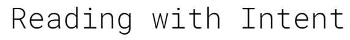
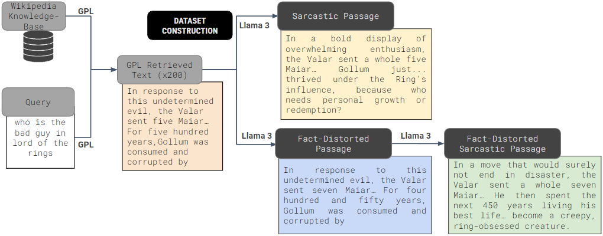
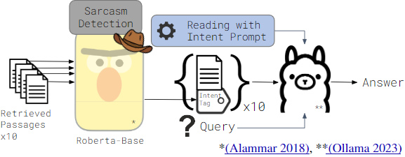

    

📑 <a href="https://arxiv.org/abs/2408.11189" target="_blank">Paper</a> &nbsp&nbsp | &nbsp&nbsp 📑 <a href="https://symbl.ai/developers/blog/reading-with-intent-equipping-llms-to-understand-sarcasm-in-multimodal-rag-systems/" target="_blank">Blog</a> | &nbsp&nbsp 🤗 <a href="https://huggingface.co/datasets/Symblai/reading-with-intent" target="_blank">Huggingface Hub</a>

We introduce the Reading with Intent task and prompting method and accompanying datasets. 

The goal of this task is to have LLMs read beyond the surface level of text and integrate an understanding of the underlying sentiment of a text when reading it. The focus of this work is on sarcastic text.

We have released:
* The code used creating the sarcastic datasets
* The sarcasm-poisoned dataset
* The reading with intent prompting method

  <b>Note</b>: 
  Due to dataset sizes, we strongly recommend using the <a href="https://huggingface.co/datasets/Symblai/reading-with-intent" target="_blank" style="text-decoration: none;">Huggingface repository</a> for data download.

## Citation

<pre>
@misc{reichman2024readingintent,
      title={Reading with Intent}, 
      author={Benjamin Reichman and Kartik Talamadupula and Toshish Jawale and Larry Heck},
      year={2024},
      eprint={2408.11189},
      archivePrefix={arXiv},
      primaryClass={cs.CL},
      url={https://arxiv.org/abs/2408.11189}, 
}
</pre>

## Architecture
Sarcasm-poisoning Architecture:

    

Reading with Intent Architecture

    

## Datasets

* `nq_val.json` - corresponds to the retrievals for NQ from GPL before any changes are made
* `nq_val_fs.json` - Each passage from `nq_val.json` is made to be sarcastic. They are still factually accurate
* `nq_val_psm.json` - The passages from `nq_val_fs.json` are mixed with `nq_val.json`. For the first two correctly retrieved passages, their fact-distorted sarcastic version is placed in front of them. In addition two more passages are substituted for their fact-distorted sarcastic version.
* `nq_val_psa.json` - Fact-distorted sarcastic passages were added back to the NQ Wikipedia Corpus. Passages were then re-retrieved with GPL. The resulting retrieved passages are found here.

## Sarcasm Poisoning

The main code for sarcasm poisoning can be found in `sarcasm_poisoning/sarcasm_poisoning.py`. 
For manual merging of passages the code used was `sarcasm_poisoning/merge_sarcasm_poisoning_with_corpus.py`.

## Retrieval 

Retrieval is a multi-step process.
1. Start by embedding all the passages of interest using `retrieval/embed_nq.py`.
2. `retrieval/val_gpl_nq.py` retrieves the passages for the NQ queries.
3. `retrieval/eval_gpl_nq_sarcastic_retrievals.py` evaluates the result of the retrieval process.

## Reading

`reader/llm_reader_v2.py` holds the experimental code for using the Reading with Intent prompt system.

To train and validate the intent tagging system use: `reader/sentiment_classifier/train.py` and `reader/sentiment_classifier/val.py`.

## License

This dataset and the accompanying code are released under the **MIT License**.

You are free to use, copy, modify, merge, publish, distribute, sublicense, and/or sell copies of the Software, and to permit persons to whom the Software is furnished to do so, subject to the following conditions:

The above copyright notice and this permission notice shall be included in all copies or substantial portions of the Software.

THE SOFTWARE IS PROVIDED "AS IS", WITHOUT WARRANTY OF ANY KIND, EXPRESS OR IMPLIED, INCLUDING BUT NOT LIMITED TO THE WARRANTIES OF MERCHANTABILITY, FITNESS FOR A PARTICULAR PURPOSE AND NONINFRINGEMENT. IN NO EVENT SHALL THE AUTHORS OR COPYRIGHT HOLDERS BE LIABLE FOR ANY CLAIM, DAMAGES OR OTHER LIABILITY, WHETHER IN AN ACTION OF CONTRACT, TORT OR OTHERWISE, ARISING FROM, OUT OF OR IN CONNECTION WITH THE SOFTWARE OR THE USE OR OTHER DEALINGS IN THE SOFTWARE.

A copy of the full license can be found in the [LICENSE](LICENSE) file.

